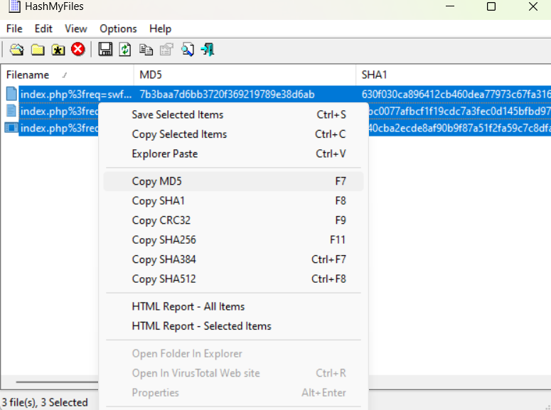

# Wireshark Analysis and IOC Investigation

This repository provides a structured walkthrough of a Wireshark analysis tutorial, focusing on identifying Indicators of Compromise (IOCs) and investigating malicious network activity. It documents key steps for network forensics and traffic analysis.

## Repository Structure

```
Wireshark-IOC-Investigation/
├── README.md                                      # Main documentation
├── PCAPs/                                         # PCAP files (if available)
├── analysis/                                      # Detailed analysis and results
│ ├── export.png                                   # Exported HTTP objects from Wireshark
│ ├── find_host_name.png                           # Extracted hostnames from network traffic
│ ├── find_mac_address.png                         # Extracted MAC addresses of infected machines
│ ├── find_url_of_infected_sites.png               # Domains and URLs of malicious websites
│ ├── first_hash.png                               # VirusTotal scan of first hash
│ ├── get_hashes.png                               # Extracted hashes from infected files
│ ├── hierarchy_protocol_http_filter.png           # Protocol hierarchy and filter usage
│ ├── http_request.png                             # HTTP request analysis with packet details
│ ├── second_hash.png                              # VirusTotal scan of second hash
│ ├── third_hash.png                               # VirusTotal scan of third hash
├── images/                                        # Supporting images and screenshots
│ ├── questions.png                                # Investigation summary image
```

## Investigation Workflow

### Extract Hashes from Malicious Files
- **Tools:** Wireshark, [Hash My Files](https://www.nirsoft.net/utils/hash_my_files.html)
- **Reference:**  
    
    
    
    
    

### Identify Malicious Domains and URLs
- **Tools:** Wireshark, VirusTotal
- **Reference:**  
  

### Analyze Protocol Hierarchy & HTTP Requests
- **Tools:** Wireshark Filters
- **Reference:**  
    
    

### Extract MAC Addresses and Hostnames of Affected Devices
- **Tools:** Wireshark
- **Reference:**  
    
    

### Analyze Exported Objects from Wireshark
- **Tools:** Wireshark Export Feature
- **Reference:**  
    

## Key Findings

- **Malicious Files Identified:**
  - **SWF Exploit:** `7b3baa7d6bb3720f369219789e38d6ab` (infected)
  - **Java Exploit:** `1e34fdebbf655ceba78b45e43520ddff` (infected)
  - **Clean File:** `d27c68dcdbdcdb674ee02496bc90d98` (not infected)

- **Infected Domain Identified:**
  - `stand.trustandprobate realty.com`

- **Source and Destination IPs:**
  - **Malicious Site IP:** `37.200.69.143`
  - **Infected Device IP:** `172.16.165.165`

- **Infected Machine Details:**
  - **Hostname:** `K34EN6W3N-PC`
  - **MAC Address:** `f0:19:af:02:9b:f1`

## Additional Resources

- [Wireshark Official Documentation](https://www.wireshark.org/docs/wsug_html_chunked/)
- [Malware Traffic Analysis](https://malware-traffic-analysis.net)
- [Hash My Files](https://www.nirsoft.net/utils/hash_my_files.html)

## How to Use This Repository

1. **Download and Open the Provided PCAP Files in Wireshark.**
2. **Use the Filters and Analysis Steps Described to Investigate Malicious Traffic.**
3. **Cross-check Findings with VirusTotal or Other Threat Intelligence Sources.**
4. **Export Objects and Hash Suspicious Files for Malware Identification.**

## Contributing

Contributions are welcome! Feel free to submit pull requests with improvements or additional analysis insights.

## Author

[devingallagher](https://github.com/devingallagher)
